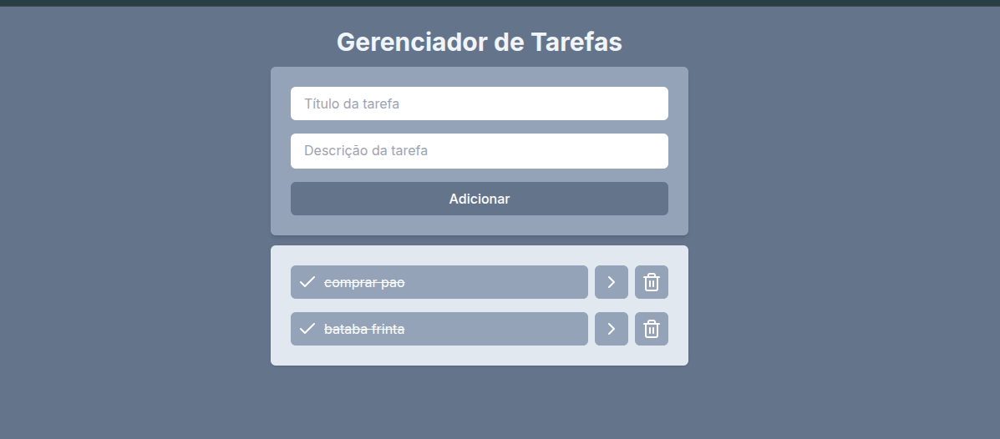

# Lista de Tarefas — Projeto Fullstack

Projeto de estudo para consolidar conhecimentos em React (frontend) e FastAPI (backend).

Resumo

- Frontend: React + Vite + Tailwind (pasta `frontend/`)
- Backend: FastAPI + SQLite (pasta `backend/taskAPI`)

Principais ferramentas

- Node.js e npm (frontend)
- React 18, Vite, Tailwind
- Python 3, FastAPI, Uvicorn (backend)
- SQLite (banco local)

O que o projeto permite

- Cadastrar novas tarefas (título + descrição)
- Listar todas as tarefas
- Visualizar detalhes de uma tarefa (página de detalhes)
- Marcar/desmarcar tarefa como concluída
- Deletar tarefas
- Comunicação simples entre frontend (React) e backend (FastAPI) via chamadas HTTP

> Observação
> Atualmente o sistema não possui autenticação nem controle de usuários. Todas as tarefas são armazenadas em uma única tabela do banco de dados, portanto qualquer usuário que acessar a aplicação visualizará e manipulará o mesmo conjunto de tarefas.

Arquivos README específicos

- `backend/README.md` — instruções e detalhes do backend
- `frontend/README.md` — instruções e detalhes do frontend
Demonstração

